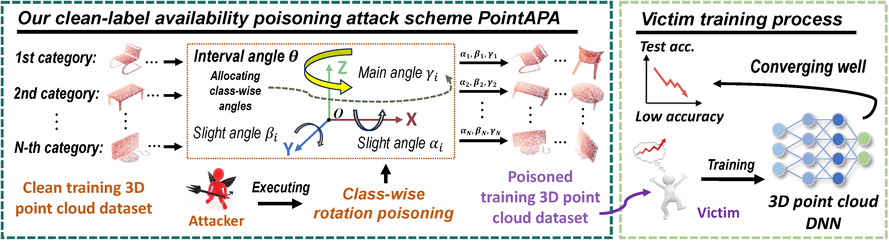

# PointAPA
The official implementation of our ESORICS 2024 paper "*[PointAPA: Towards Availability Poisoning Attacks in 3D Point Clouds](https://doi.org/10.1007/978-3-031-70879-4_7)*", by *[Xianlong Wang](https://wxldragon.github.io/), [Minghui Li](http://trustai.cse.hust.edu.cn/index.htm), [Peng Xu](https://faculty.hust.edu.cn/xupeng1/zh_CN/index.htm), [Wei Liu](https://wilmido.github.io/), [Leo Yu Zhang](https://experts.griffith.edu.au/41503-leo-zhang), [Shengshan Hu](http://trustai.cse.hust.edu.cn/index.htm), and [Yanjun Zhang](https://profiles.uts.edu.au/Yanjun.Zhang).*

 


## Abstract
Recently, the realm of deep learning applied to 3D point clouds has witnessed significant progress, accompanied by a growing concern about the emerging security threats to point cloud models. While adversarial attacks and backdoor attacks have gained continuous attention, the potentially more detrimental _availability poisoning attack_ (APA) remains unexplored in this domain. In response, _we propose the first APA approach in 3D point cloud domain_ (PointAPA), which _utilizes class-wise rotations to serve as shortcuts for poisoning, thus satisfying efficiency, effectiveness, concealment, and the black-box setting._ Drawing inspiration from the prevalence of shortcuts in deep neural networks, we exploit the impact of rotation in 3D data augmentation on feature extraction in point cloud networks. This rotation serves as a shortcut, allowing us to apply varying degrees of rotation to training samples from different categories, creating effective shortcuts that contaminate the training process. The natural and efficient rotating operation makes our attack highly inconspicuous and easy to launch. Furthermore, our poisoning scheme is more concealed due to keeping the labels clean (_i.e._, clean-label APA). Extensive experiments on benchmark datasets of 3D point clouds (including real-world datasets for autonomous driving) have provided compelling evidence that our approach largely compromises 3D point cloud models, resulting in a reduction in model accuracy ranging from 40.6% to 73.1% compared to clean training. Additionally, our method demonstrates resilience against _statistical outlier removal_ (SOR) and three types of random data augmentation defense schemes.

<p align="center">
  
</p>

## Latest Update
| Date       | Event    |
|------------|----------|
| **2024/09/05** | This official paper is online at [PointAPA](https://doi.org/10.1007/978-3-031-70879-4_7) !  |
| **2024/06/03** | We have released the implementation of PointAPA!  |
| **2024/03/19** | PointAPA is acccepted by ESORICS 2024 (Spring Cycle)!  |


## Start Running PointAPA
- **Get code**
```shell 
git clone https://github.com/wxldragon/PointAPA.git
```

- **Build environment**
```shell
cd PointAPA
conda create -n PointAPA python=3.9
conda activate PointAPA
pip install -r requirements.txt
```

- **Download datasets**
  - Please download ModelNet dataset at: [[ModelNet](https://www.kaggle.com/datasets/chenxaoyu/modelnet-normal-resampled)], ShapeNetPart dataset at: [[ShapeNetPart](https://www.kaggle.com/datasets/mitkir/shapenet)]
  - Unzip the datasets.zip files in ```PointAPA/clean_data```

 
- **Generate PointAPA (_i.e._, poisoned) datasets**
```shell
python poison_generation.py --dataset ModelNet10 --interval 42 
```

- **Perform clean training**
```shell
python train.py --dataset ModelNet10 --target_model pointnet_cls
```

- **Perform poison training for evaluation of PointAPA's effectiveness**
```shell
python train.py --dataset ModelNet10 --target_model pointnet_cls --poison_train --interval 42
```

- **Perform poison training under defenses for evaluation of PointAPA's robustness**
```shell
python train.py --dataset ModelNet10 --target_model pointnet_cls --poison_train --interval 42 --defense --aug_type sca
```


## BibTex
If you find PointAPA both interesting and helpful, please consider citing us in your research or publications:
```bibtex
@inproceedings{wang2024pointapa,
  title={PointAPA: Towards Availability Poisoning Attacks in 3D Point Clouds},
  author={Wang, Xianlong and Li, Minghui and Xu, Peng and Liu, Wei and Zhang, Leo Yu and Hu, Shengshan and Zhang, Yanjun},
  booktitle={Proceedings of the 29th European Symposium on Research in Computer Security (ESORICS'24)},
  year={2024}
}
```

